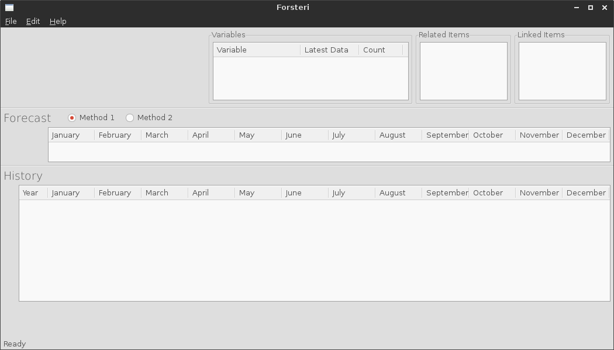

Getting Started
===============

Linux
-----

To get the source, clone it from Github with 

::

    $ git clone http://github.com/achawkins/Forsteri

Now run the command

::

    $ ./Forsteri/bin/forsteri

from the terminal to start the program.

Windows
-------

    Next

If you were successful in starting the program you will now see the following frame.

